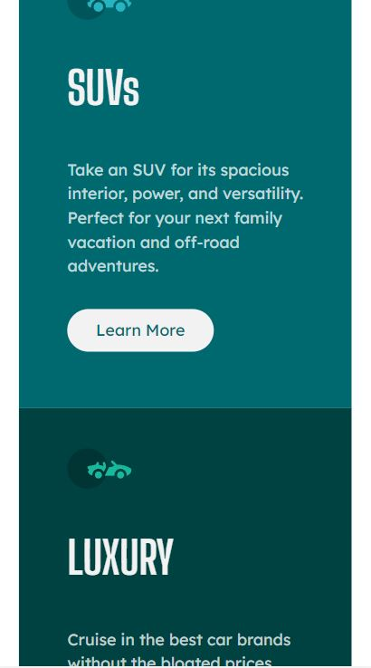

# Frontend Mentor - 3-column preview card component solution

This is my personal solution to the [3-column preview card component challenge on Frontend Mentor](https://www.frontendmentor.io/challenges/3column-preview-card-component-pH92eAR2-). 

## Heres are a few features of my website / component

* The HTML uses semantic tags where possible.
* Mobile first design as to be inline with Googles mobile first indexing best practices in relation to SEO.
* The page is responsive, currently has 2 breakpoints but more may be added in the future.
* The use of CSS Flexbox to further increase the responsiveness of the page for all screen sizes.
* Rems used as the prefered unit of measure. 
* (Learn More) CTA anchor tags styled as buttons. By making each card its own flex container / card / column and setting the
.btn-learn-more { margin-top: auto; } it ensures on desktop size screens that the learn more buttons will stay in horizontal alignment with each other regardless of the different lengths of content in each card;

## Table of contents

  - [Screenshot](#screenshot)
  - [Links](#links)
  - [Built with](#built-with)
  - [Author](#author)

### Screenshot
##### Desktop View - Below

##### Mobile View - Below

### Links

- Solution URL: [https://github.com/jacksen30/multi-column-preview-component]
- Live Site URL: [https://multi-column-preview.netlify.app/]

### Built with

- Semantic HTML5 markup
- CSS 3

## Author

- Website - [Jacksen Nillson](https://www.quotemkr.com)
- Frontend Mentor - [@jacksen30](https://www.frontendmentor.io/profile/jacksen30)